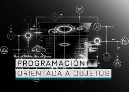

<h1 align="center">Hola 👋,Bienvenidos a la materia de PROGRAMACION ORIENTADA A OBJETOS</h1>
<h3 align="center">Mi nombre es Miguel Angel Ruiz Martinez</h3>
<h3 align="center">Sere su profesor en este semestre Enero Junio 2022</h3>

  

  

- Para esta primera unidad analizaremos el entorno de desarrollo que usaremos durante la materia

- Para esto te invito a ver el siguiente video:

  

- Posteriormente realiza los ejercicios de la carpeta de actividades

- Que tengas un excelente dia.

- Si tienes dudas, al menos no tengas la duda de contactarme para ayudarte